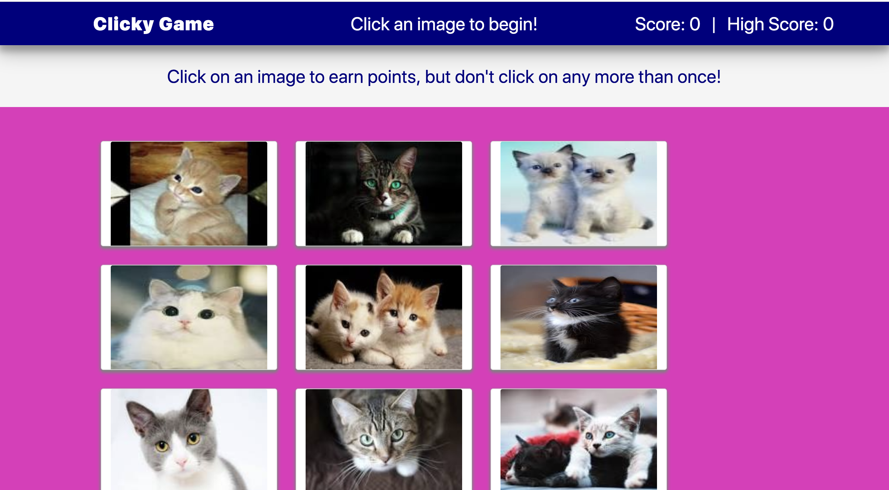
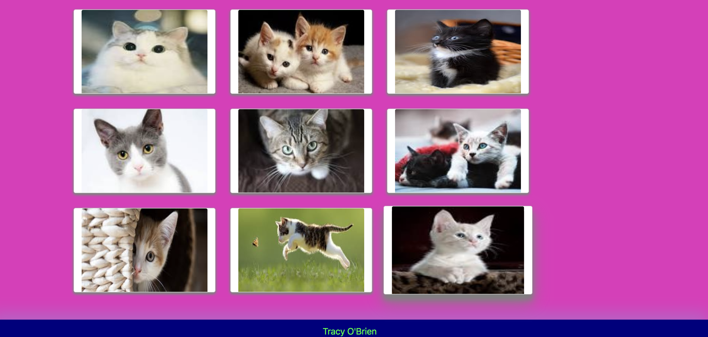

# Clicky-Game

## Instructions

1. Create a new React application using Create React App.

2. The app should render 12 different images of kitties to the screen. Each image listens for click events.

3. The app keeps track of the user's score. The user's score is incremented when  an image is clicked for the first time. 

4. Every time an image is clicked, the images rendered to the page shuffles in a random order.

## Technologies used

* React
* ES6
* Bootstrap
* CSS

## Website
[Heroku](https://clickygame757.herokuapp.com/)

## Available Scripts

In the project directory, you can run:

### `npm start`

Runs the app in the development mode. 
Open [http://localhost:3000](http://localhost:3000) to view it in the browser.

The page will reload if you make edits. 
You will also see any lint errors in the console.

Below are photos of the project in app mode:

